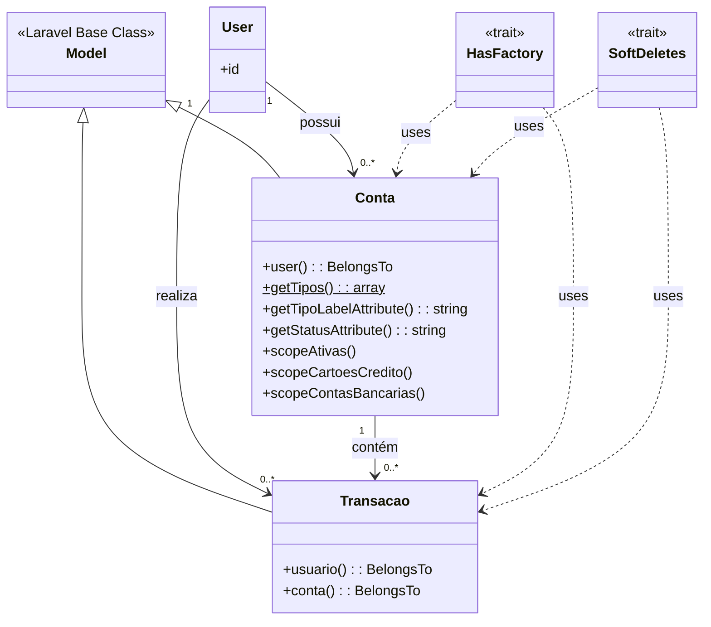
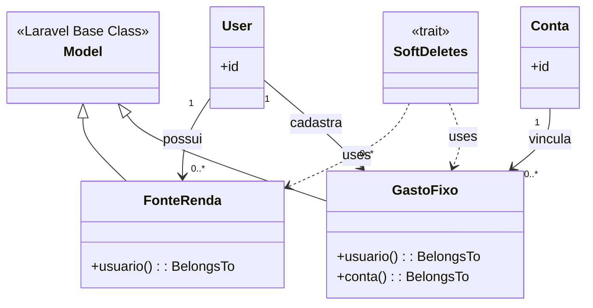
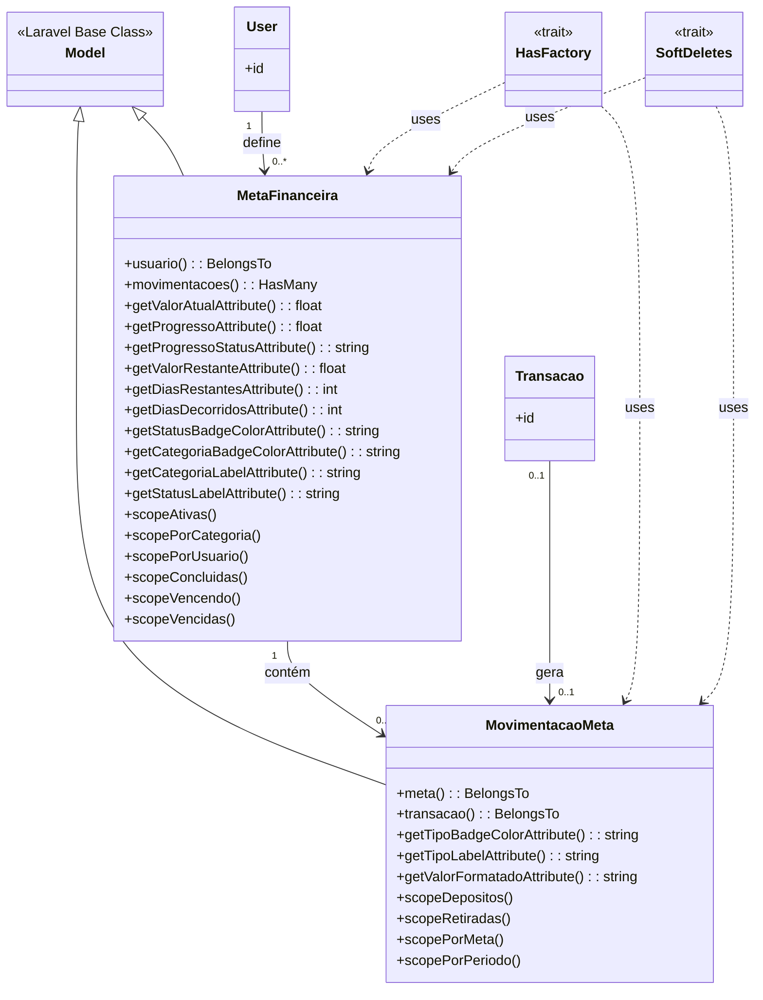
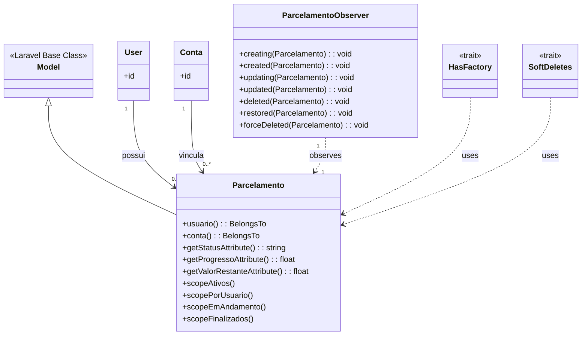

#### Contas e Transações

**Responsável pelo gerenciamento de contas bancárias e movimentações financeiras. As contas podem ser de diferentes tipos (corrente, poupança, cartão) e cada transação está vinculada a uma conta específica. Este contexto forma a base operacional do sistema, registrando todas as movimentações financeiras dos usuários. Implementa scopes para facilitar consultas específicas por tipo de conta.**

#### Gastos e Receitas

**Gerencia as fontes de renda e gastos fixos dos usuários. FonteRenda registra todas as entradas financeiras recorrentes, enquanto GastoFixo controla despesas regulares vinculadas a contas específicas. Este contexto é essencial para o planejamento financeiro, permitindo que usuários tenham visibilidade sobre seus fluxos de entrada e saída previsíveis. Ambas as classes suportam soft delete para histórico.**

#### Metas Financeiras

**Sistema completo de definição e acompanhamento de objetivos financeiros. MetaFinanceira permite aos usuários estabelecer metas com prazos e valores, enquanto MovimentacaoMeta registra todos os depósitos e retiradas. Inclui cálculos automatizados de progresso, dias restantes e status. Este é o contexto mais rico em regras de negócio, fornecendo insights detalhados sobre o progresso das metas através de múltiplos accessors e scopes.**

#### Parcelamentos

**Controla compras e gastos parcelados dos usuários. A classe Parcelamento gerencia informações como valor total, número de parcelas e progresso de pagamento. O ParcelamentoObserver implementa o padrão Observer, automatizando cálculos e validações em tempo real. Este contexto é fundamental para o controle de compromissos financeiros futuros, oferecendo visibilidade completa sobre parcelas pendentes e quitadas.**

