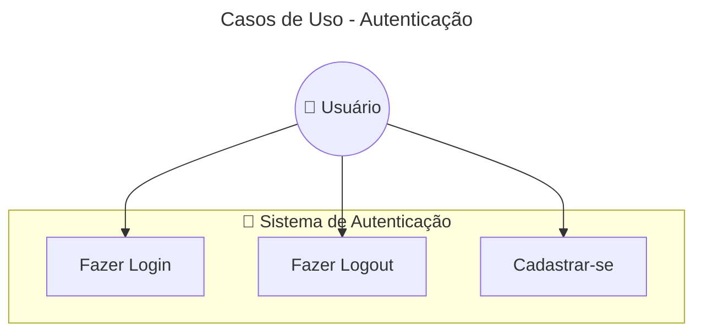
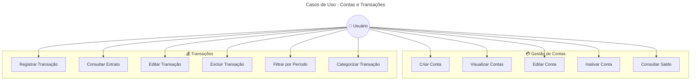
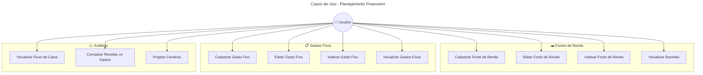
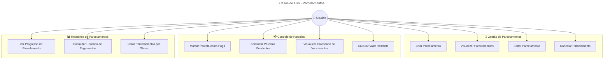

## Casos de uso

```mermaid
---
title: Casos de Uso - Autenticação
---
graph TB
    User((👤 Usuário))
    
    subgraph "🔐 Sistema de Autenticação"
        UC1[Fazer Login]
        UC2[Fazer Logout]
        UC3[Cadastrar-se]
    end
    
    User --> UC1
    User --> UC2
    User --> UC3
```

```mermaid
---
title: Casos de Uso - Contas e Transações
---
graph TB
    User((👤 Usuário))
    
    subgraph "💳 Gestão de Contas"
        UC1[Criar Conta]
        UC2[Visualizar Contas]
        UC3[Editar Conta]
        UC4[Inativar Conta]
        UC5[Consultar Saldo]
    end
    
    subgraph "💰 Transações"
        UC6[Registrar Transação]
        UC7[Consultar Extrato]
        UC8[Editar Transação]
        UC9[Excluir Transação]
        UC10[Filtrar por Período]
        UC11[Categorizar Transação]
    end
    
    User --> UC1
    User --> UC2
    User --> UC3
    User --> UC4
    User --> UC5
    User --> UC6
    User --> UC7
    User --> UC8
    User --> UC9
    User --> UC10
    User --> UC11
```

```mermaid
---
title: Casos de Uso - Planejamento Financeiro
---
graph TB
    User((👤 Usuário))
    
    subgraph "💵 Fontes de Renda"
        UC1[Cadastrar Fonte de Renda]
        UC2[Editar Fonte de Renda]
        UC3[Inativar Fonte de Renda]
        UC4[Visualizar Receitas]
    end
    
    subgraph "📋 Gastos Fixos"
        UC5[Cadastrar Gasto Fixo]
        UC6[Editar Gasto Fixo]
        UC7[Inativar Gasto Fixo]
        UC8[Visualizar Gastos Fixos]
    end
    
    subgraph "📈 Análises"
        UC9[Visualizar Fluxo de Caixa]
        UC10[Comparar Receitas vs Gastos]
        UC11[Projetar Cenários]
    end
    
    User --> UC1
    User --> UC2
    User --> UC3
    User --> UC4
    User --> UC5
    User --> UC6
    User --> UC7
    User --> UC8
    User --> UC9
    User --> UC10
    User --> UC11
```

```mermaid
---
title: Casos de Uso - Parcelamentos
---
graph TB
    User((👤 Usuário))
    
    subgraph "📄 Gestão de Parcelamentos"
        UC1[Criar Parcelamento]
        UC2[Visualizar Parcelamentos]
        UC3[Editar Parcelamento]
        UC4[Cancelar Parcelamento]
    end
    
    subgraph "💳 Controle de Parcelas"
        UC5[Marcar Parcela como Paga]
        UC6[Consultar Parcelas Pendentes]
        UC7[Visualizar Calendário de Vencimentos]
        UC8[Calcular Valor Restante]
    end
    
    subgraph "📊 Relatórios de Parcelamentos"
        UC9[Ver Progresso do Parcelamento]
        UC10[Consultar Histórico de Pagamentos]
        UC11[Listar Parcelamentos por Status]
    end
    
    User --> UC1
    User --> UC2
    User --> UC3
    User --> UC4
    User --> UC5
    User --> UC6
    User --> UC7
    User --> UC8
    User --> UC9
    User --> UC10
    User --> UC11
```
